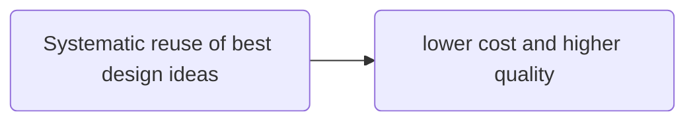
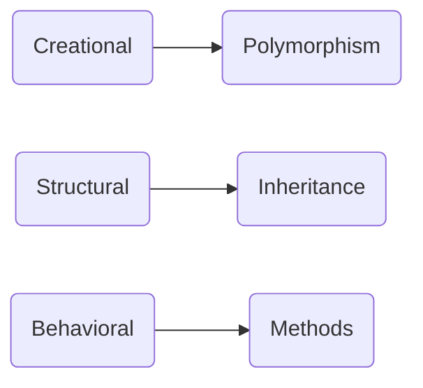
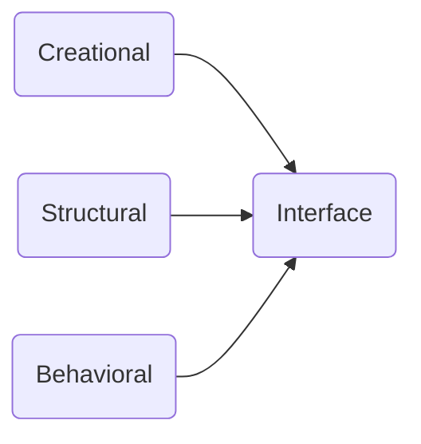

Design patterns are the well-known solutions to **recurring** problems.

### Characteristics

- Language neutral
- Dynamic
- Incomplete by design to promote customization.

### Design pattern types

- Creation
  - Use
    - Create objects systematically
  - Benefits
    - Flexibility
- Structural
  - Use
    - Establish relationship between software components
    - Accomplish both functional and non-functional goals
  - Benefits
    - Based on the goals structures can be defined
- Behavioral
  - Use
    - How well the objects can interact with each other
    - Accomplish both function and non-function goals
  - Benefits
    - Defining protocols while these objects interacting each other to achieve the common goal

### OOP use case for design patterns

