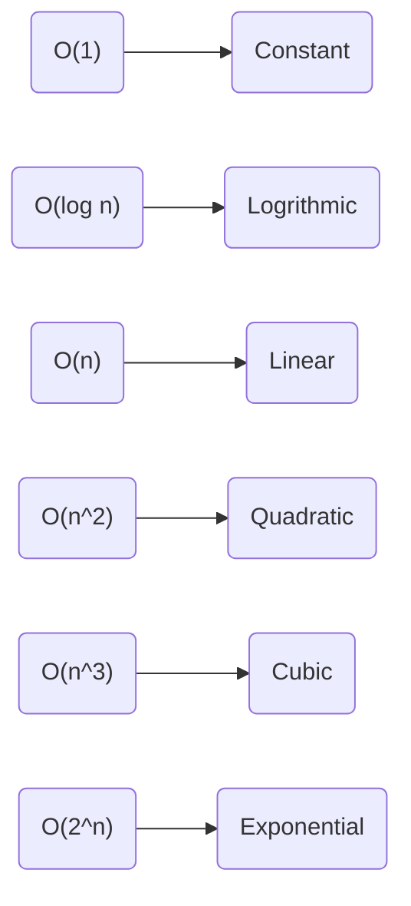
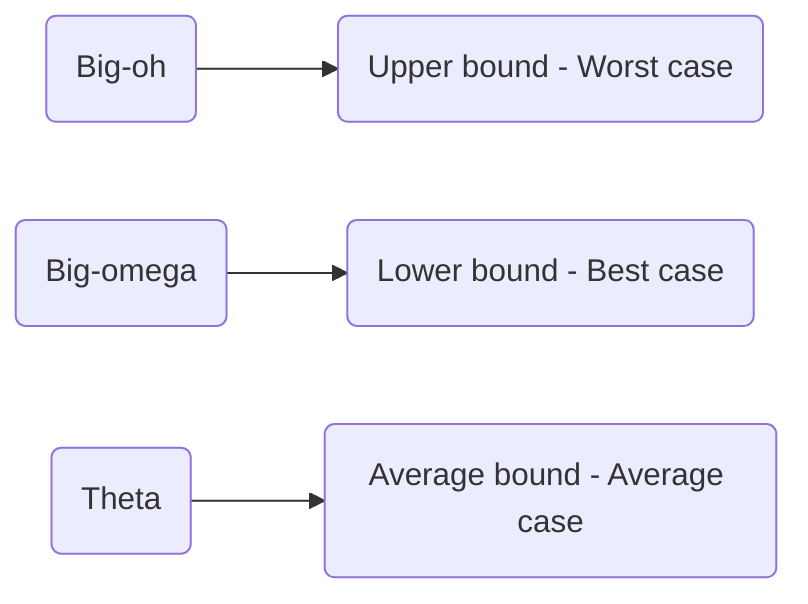

## Algorithms

Algorithms are process or set of rules to be followed in calculations or other problem-solving operations, especially by a computer.

### Characteristics of algorithms

- **Input:** 0 or more
- **Output:** at least one output
- **Definiteness:** Unambiguous
- **Finiteness:** Duration of algorithm should be finite
- **Effectiveness:** Unnecessary steps are not allowed

### How to write an algorithm

Algorithm for swapping two numbers:

```code
swap(a, b)
Begin
    temp := a
    a := b
    b := temp
End
```

### How to analyze an algorithm

#### Criteria

1. **Time**
2. **Space**
3. Network(Data Consumption)
4. Power Consumption
5. CPU Consumption

### Types of time functions



```code
Order of weight
1 < log n < sqrt(n) < n log n < n^2 < n^3 ... < n^n
```

### Asymptotic notations

These notations represent the bound of the functions:



$$
\begin{align*}
log a*b = log a + log b \\
log a/b = log a - log b \\
log a^b = b log a \\
a^{log_cb} = b^{log_ca} \\
If \; a^b = n \; then \; b=log_an
\end{align*}
$$

### Leaner Search

A linear search or sequential search is a method for finding an element within a list. It sequentially checks each element of the list until a match is found, or the whole list has been searched.


```code
Worst Time complexity: O(n)
Average Time complexity: O(n+1/2)
Best Time complexity: O(1)
```

### Binary Search

Binary Search is a searching algorithm used in a sorted array by repeatedly dividing the search interval in half.


```code
Worst Time complexity: O(log n)
Average Time complexity: O(log n)
Best Time complexity: O(1)
```