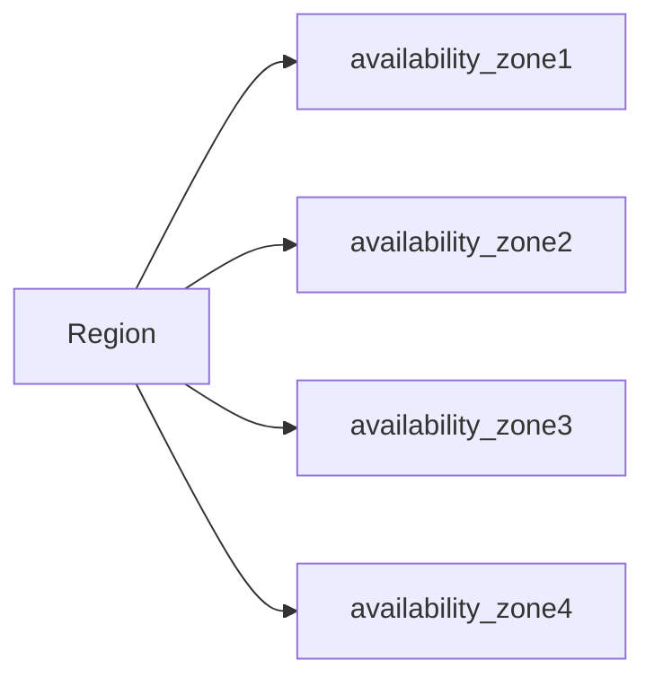

## EC2: Elastic Compute Cloud

This is virtual machine which on the cloud, but as the word `Elastic` means, it stretches the computing power based on the requirements. Ex: when there is a heavy load on a server it can scale it self and when the load has been decrease it can down scale itself.

## S3: Simple Storage Service

This is simple storage service, which allows users to store their files in the cloud as a  backup, Ex: when `Dropbox` created it was using aws S3 and EC2.

**Note:** **Infrastructure as a service(IaaS)** which means you rent virtual infrastructure  on the cloud and pay for what you use.

**Availability Zone**: The locations of the data centres under a particular regions.

