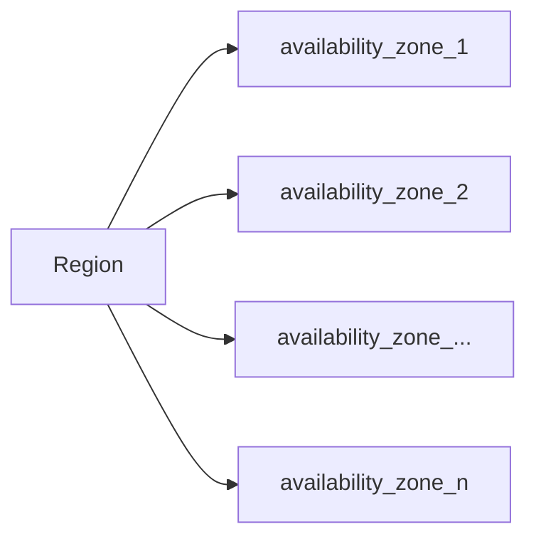

## EC2: Elastic Compute Cloud

This is a virtual machine on the cloud, but as the word `Elastic` means, it stretches the computing power based on the requirements. Ex: when there is a heavy load on a server it can scale itself and when the load has been decreasing it can be downscale itself.

## S3: Simple Storage Service

This is a simple storage service, which allows users to store their files in the cloud as a backup, Ex: when `Dropbox` was created it was using AWS S3 and EC2.

**Note:** **Infrastructure as a service(IaaS)** which means you rent virtual infrastructure on the cloud and pay for what you use.

**Availability Zone**: The locations of the data centers under a particular region.

There are cheaper storage models are available in s3. Ex: glacier is one of the model which is cheaper in cost but access time is high. It's good for having non-frequent use contents in this storage, and also we can configure our s3 bucket for various data storage life cycles.



## Types of EC2 Instance in AWS

### General purpose Instance

This kind of instance used for general purpose work, where there not a lot of requirements for `CPU` intensive work, as well as huge `RAM` intensive work, it's a balanced instance which can be used for moderate usage. The size of the instance are measured in t-shirt sizes based on that corresponding `CPU` and `RAM` will be decided.

There are instances which will be used for different purposes based on the need, they are below:

* Micro instance
* Compute optimized instance
* FPGA instance
* GPU instance
* Memory optimized instance
* Storage optimized instance

**Note:** we can compare and find our best match instance based on our need [here](https://instances.vantage.sh)

## Security Group

Security groups are nothing but a firewall in AWS, which controls internet traffic of server, which prevents the unwanted attacks from the internet when we're exposing our server to the internet for public usage.


## Auto Scaling

Auto-scaling is happening when our instance reached 80% of the utilization of the allocated resource and if you have configured the machine clones(snapshot of the machine config) and automated for the scaling it will scale itself when the traffic is up, and it will down scale when the traffic is down. There are two types of scaling is used in the industry:

1. Vertical scaling - stop the instance and upgrade with the higher computing capacity instance.
2. Horizontal scaling - make sever copy of the cloned instance of your instance auto-scaled based on the requirements.

## EBS: Elastic Block Store

This is the default storage for EC2 instances, and it's faster. We can take snapshots of this storage, and we can start a new instance based on these snapshots. One con's of this storage one we initiated an instance in this EBS we can not share them with the other instance and also the data of the cloned instance won't be in sync
that's why we use EFS(Elastic File System).

## EFS: Elastic File System

It's like NAS(Network Attached Storage) appliance which means it can create a file share environment, using which we can share the data between two instances. We can create new `EFS` in AWS and using resource ID security policy we can allow them to connect to our instance, once the permissions sets to allow we can mount this on the instance, remember It's not as much as faster than the `EBS` because those are nearby our compute engine, we can use this drives for common data share such as stored customer data which need to be shared across the instance to serve clients, keep source code like application code base in `EBS` for higher performance.

## AWS SDK(Software Development Kit)

AWS SDK supports most of the programming languages. Ex: for python, we can use [Boto3](https://github.com/boto/boto3) module which will allow us to integrate python application to AWS services.
Ex: if we want to find and start the stopped instances we can use the below code snippet.

```python
import boto3
ect2 = boto3.resource('ec2')
for i in ec2.instances.all():
    if i.state['Name'] == 'stopped':
        i.start()
```

We can follow [this](https://boto3.amazonaws.com/v1/documentation/api/latest/index.html) doc for more use

## Cloud Front

It's a CDN which can mirror the S3 buckets, the use case would be serving the customers based on their nearby locations.

## VPC: Virtual Private Network

It's a set of rules that allows the AWS instance contact each other using a private network connectivity, without connecting to the public network.


## NAT: Network Address Translation

It's a mechanism used for accessing the public internet from a private network securely.


## Internet Gateway

It's allows public servers to serve the clients on the internet. AWS instance has this public IP to serve but, when an instance has been rebooted it will return the old IP to the pool and assigns the new public IP to the instance.


## ELB: Elastic Load Balancer

This helps to transmit the server traffics among the healthy servers.
