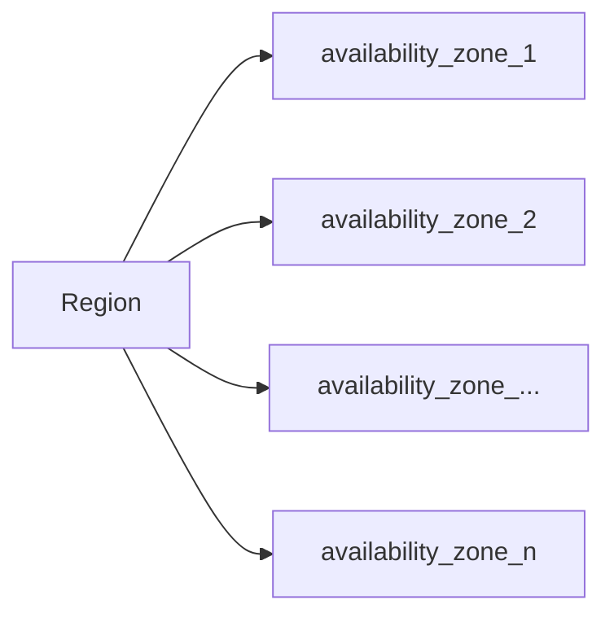

## EC2: Elastic Compute Cloud

This is virtual machine which on the cloud, but as the word `Elastic` means, it stretches the computing power based on the requirements. Ex: when there is a heavy load on a server it can scale it self and when the load has been decrease it can down scale itself.

## S3: Simple Storage Service

This is simple storage service, which allows users to store their files in the cloud as a  backup, Ex: when `Dropbox` created it was using aws S3 and EC2.

**Note:** **Infrastructure as a service(IaaS)** which means you rent virtual infrastructure  on the cloud and pay for what you use.

**Availability Zone**: The locations of the data centres under a particular regions.

## Types of EC2 Instance in AWS

### General purpose Instance

This kind of instance used for general purpose work, where there not lot of requirement for `CPU` intensive work, as well as huge `RAM` intensive work, it's a balanced instance which can be used for moderate usage. The size of the instance are measured in t-shirt sizes based on that corresponding `CPU` and `RAM` will be decided.

There are instance which will be used for different purposes based on the need, they are below:

* Micro instance
* Compute optimized instance
* FPGA instance
* GPU instance
* Memory optimized instance
* Storage optimized instance

**Note:** we can compare and find our best match instance based on our need [here](https://instances.vantage.sh)

## Security Group

Security groups are nothing but a firewall in aws, which controls internet traffic of server, which prevents the unwanted attacks from the internet when we exposing our server to the internet for public usage.

