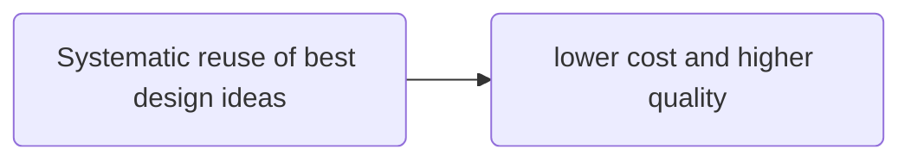
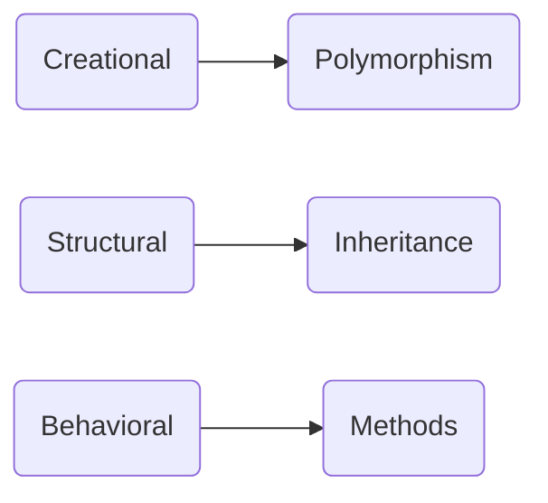
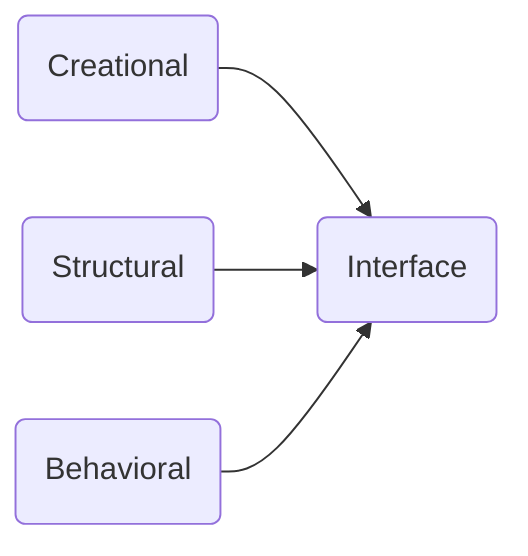
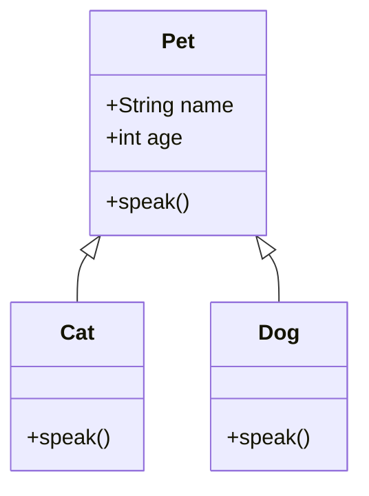
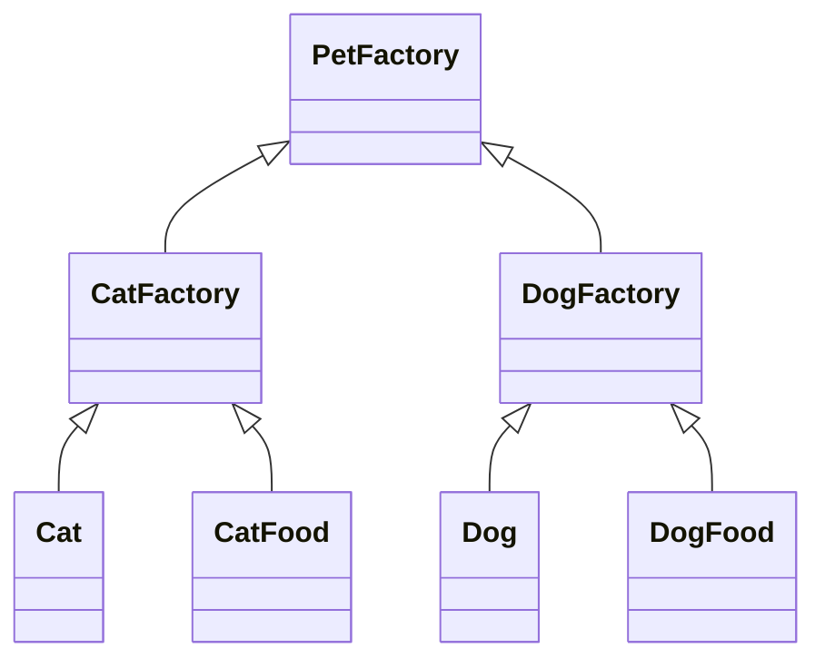

Design patterns are the well-known solutions to **recurring** problems.



### Characteristics

- Language neutral
- Dynamic
- Incomplete by design to promote customization.

### Design pattern types

- Creation
  - Use
    - Create objects systematically
  - Benefits
    - Flexibility
- Structural
  - Use
    - Establish relationship between software components
    - Accomplish both functional and non-functional goals
  - Benefits
    - Based on the goals structures can be defined
- Behavioral
  - Use
    - How well the objects can interact with each other
    - Accomplish both function and non-function goals
  - Benefits
    - Defining protocols while these objects interacting each other to achieve the common goal

### OOP use case for design patterns





### Inheritance

In object-oriented programming, inheritance is the mechanism of basing an object or class upon another object or class, retaining similar implementation. Also defined as deriving new classes from existing ones such as super class or base class and then forming them into a hierarchy of classes.



In the above **Cat** and **Dog** can inherit the attributes of **Pet**, but it will override the attribute _speak()_ based on their requirement.

### Polymorphism

- Relies on inheritance
- Allows child classes to be instantiated and treated as the same type as their parent
- Enables a parent class to be manifested any of its child classes.

### How to describe design pattern context

- Participants
  - Class involved to form a design pattern
  - Roles of these classes
- Quality attributes
  - Nonfunctional requirement's such as
    - usability
    - modifiability
    - reliability
    - performance
  - Effect on the entire software, such as
    - architectural solutions
- Forces
  - Various factors or trade-offs to consider
    - manifested in quality attributes
    - unintended consequences
- Consequences
  - worse performance
  - Decision makers should consider consequences.

### Pattern Language

- Name
  - capture the gist
  - vocabulary
  - Meaningful and memorable
- Context
  - Scenario
  - Insights on when and where
- Problem
  - Design challenges the pattern trying to address
- Solution
  - Specifies the pattern
  - Structure → relationships (between the elements)
  - Behavior → interactions (between the elements)
- Related patterns
  - Lists other patterns used to describe
  - Used together to solve a problem
  - Similar but different

## Creation patterns

## Factory

**Factory encapsulate object creation** that is factory is an object that is specialized in creating other object.

### Factory problem situation

- Uncertain in type of objects
- Decision to be made in runtime regarding what classes to use.

### Factory Scenario

A pet shop originally selling dogs only, now they want to sell cats too, and they want to describe their attributes too.

### Factory method implementation

```python
class Dog:
  """A simple Dog class"""
  def __init__(self, name):
    slef._name = name

  def speak(self):
    return "Woof"
```

```python
class Cat:
  """A simple Cat class"""
  def __init__(self, name):
    slef._name = name

  def speak(self):
    return "Meow"
```

```python
# The below function not part of the Cat class
def get_pet(pet="dog"):
  """Factory method"""
  pets = dict(dog=Dog("Hope"), cat=Cat("Peace"))
  return pets[pet]
# now will try initiate and test above classes
d = get_pet("dog")
print(d.speak())
# Output: Woof
c = get_pet("cat")
print(c.speak())
# Output: Meow
```

## Abstract Factory

Abstract factory builds on factory pattern and it' useful when we are expecting the family of related objects at a given time but doesn't have to know which family it is until runtime.

### Abstract Factory problem situation

- The user expectations yields

### Abstract Factory scenario

A pet factory whose concrete factories include dog factory and cat factory. Both dog and cat factories produce dogs and cats, as well as related products, such as dog food and cat food.

### Abstract Factory Implementation



We implement our abstract factory without using inheritance because Python is a dynamically typed language, and therefore does not require abstract classes.

```python
class Dog:
  """One of the obhects to be returned"""
  def speak(slef):
    return "Woof!"

  def __str__(self):
    return "Dog"

class DogFactory:
  """Concrete factory"""
  def get_pet(self):
    """Returns a Dog object"""
    return Dog()
  def get_food(self):
    """Returns a Dog Food object"""
    return "Dog Food!"

class PetStore:
  """PetStore houses our Abstract Factory"""
  def __init__(self, pet_factory=None):
    """pet_factory is our Abstract Factory"""
    self._pet_factory = pet_factory # concrete factory

  def show_pet(self):
    """Utility method to display the details of the objects returned by the DogFactory"""
    pet = self._pet_factory.get_pet()
    pet_food = self._pet_factory.get_food()
    print("Our pet is '{}'!".format(pet))
    print("Our pet says hello by '{}'".format(pet.speak()))
    print("Its food is '{}'!".format(pet_food))

# Create a Concrete Factory
factory = DogFactory()

# Create a pet store housing our Abstract Factory
shop = PetStore(factory)

# Invoke the utility method to show the details of our pet
shop.show_pet()
```

## Singleton

When we have a class that is supposed to have only one instance, we can use the singleton pattern to ensure that.

### Singleton problem situation

- Global variant in an object-oriented way
- Borg
  - The Borg class implements the Borg design pattern which provides a singleton like pattern for Python. A Borg object can be accessed by calling the getInstance() function. This function returns an instance of the Borg class which stores its state between successive calls to get the Borg object.

### Singleton scenario

- An information cache shared by multiple objects

By keeping this information in a single object like Singleton or sharing it constantly in Borg objects, There is no need to retrieve the information from its original sources each time. All modules in Python act as Singletons. In our scenario, Borg acts as an information cache for networking acronyms, and their spelled out versions.

### Singleton implementation

```python
class Borg:
  """Borg class making class attributes global"""
  _shared_state = {} # Attribute dictionary

  def __init__(self):
    self.__dict__ = self._shared_state # Make it an attribute dictionary
  def __str__(self):
    return str(self._shared_state)
class Singleton(Borg): # Inherits from the Borg class
  """This class now shares all its attributes among its various instances"""
  def __init__(self, **kwargs):
    Borg.__init__(self)
    self._shared_state.update(kwargs) # Update the attribute dictionary by inserting a new key-value pair
  def __str__(self):
    return str(self._shared_state)

x = Singleton(HTTP="Hyper Text Transfer Protocol")
print(x)

y = Singleton(SNMP="Simple Network Management Protocol")
print(y)
```

## Builder

Builder is a solution to an antipattern called telescoping constructor. An antipattern is the opposite of the best programming practice and what we want to avoid.

### Builder problem situation

The telescoping constructor antipattern occurs when a software developer attempts to build a complex object using an excessive number of constructors. The builder pattern is trying to solve this problem.

### Builder problem scenario

Think of a scenario in which you're trying to build a car. This test requires various car parts to be first constructed individually and then assembled. The builder pattern brings order to this chaotic process to remove unnecessary complexity as much as possible.

### Builder implementation

 It partitions the process of building a complex object into four different roles:

- The first role is a director in charge of actually building a product.
- The second role provides all the necessary interfaces required in building an object. We call this one an abstract builder because there'll be a concrete builder inheriting from it.
- The concrete builder class inherits from the abstract builder class and actually implements the details of the interfaces of the abstract builder class for the specific type of product.
- The product role represents an object being built.

```python
class Director:
  """Director"""
  def __init__(self, builder):
    self._builder = builder

  def construct_car(self):
    self._builder.create_new_car()
    self._builder.add_model()
    self._builder.add_tires()
    self._builder.add_engine()

  def get_car(self):
    return self._builder.car

class Builder():
  """Abstract Builder"""
  def __init__(self):
    self.car = None

  def create_new_car(self):
    self.car = Car()

class SkyLarkBuilder(Builder):
  """Concrete Builder --> provides parts and tools to work on the parts"""
  def add_model(self):
    self.car.model = "Skylark"

  def add_tires(self):
    self.car.tires = "Regular tires"

  def add_engine(self):
    self.car.engine = "Turbo engine"

class Car():
  """Product"""
  def __init__(self):
    self.model = None
    self.tires = None
    self.engine = None

  def __str__(self):
    return '{} | {} | {}'.format(self.model, self.tires, self.engine)

builder = SkyLarkBuilder()
director = Director(builder)
director.construct_car()
car = director.get_car()
print(car)
```

## Prototype

Prototype clones objects according to a prototypical instance. Here the keyword is cloning. Note that we're talking about making a copy instead of building.

### Prototype problem situation

Prototype is useful when instantiating many identical objects individually, which could be expensive in terms of computing power. Cloning could be a good alternative because it makes a carbon copy in the memory space instead of building individual objects, respectively, from scratch the usual way.

### Prototype problem scenario

Let's assume that we are building a car. We can mass produce cars more easily and quickly If the cars have the same color and options. Similarly, in our Python programming scenario, you can clone the objects by making a copy of a prototype object instead of building them through constructors, as long as they're supposed to be identical without variations.

### Prototype implementation

Our solution consists of creating a prototypical instance first and then cloning it whenever you need the replica. **The pattern related to the prototype pattern is the abstract factory**.

```python
import copy

class Prototype:
  """Prototype"""
  def __init__(self):
    self._objects = {}

  def register_object(self, name, obj):
    """Register an object"""
    self._objects[name] = obj

  def unregister_object(self, name):
    """Unregister an object"""
    del self._objects[name]

  def clone(self, name, **attr):
    """Clone a registered object and update its attributes"""
    obj = copy.deepcopy(self._objects.get(name))
    obj.__dict__.update(attr)
    return obj

class Car:
  """Product"""
  def __init__(self):
    self.name = "Skylark"
    self.color = "Red"
    self.options = "Ex"

  def __str__(self):
    return '{} | {} | {}'.format(self.name, self.color, self.options)

c = Car()
prototype = Prototype()
prototype.register_object('skylark', c)
c1 = prototype.clone('skylark')
```

## Structural Patterns

## Decorator

The decorator design pattern is a structural pattern that allows users to add new features to existing objects without changing their structures.

Pattern makes implementing the decorator pattern very straightforward due to its built-in language feature.

### Decorator problem situation

 Our challenge here is to add additional features to an existing object dynamically without using subclasses.

### Decorator problem scenario

We start with a function displaying a hello world message. You want to make the message look fancier by decorating it with additional tasks, such as blink.

### Decorator implementation

Functions are objects in Python, and we can add additional features to these functions using the built-in decorator in Python.

Patterns such as adapter, composite and strategy are related to the decorator pattern.

```python
from functools import wraps

def make_blink(function):
  """Defines the decorator"""
  # This makes the decorator transparent in terms of its name and docstring
  @wraps(function)
  # Define the inner function
  def decorator():
    # Grab the return value of the function being decorated
    ret = function()
    # Add new functionality to the function being decorated
    return "<blink>{}</blink>".format(ret)
  return decorator

# Apply the decorator here!
@make_blink
def hello_world():
  """Original function"""
  return "Hello World!"

# Check the result of decorating
print(hello_world())
# Check if the function name is still the same
print(hello_world.__name__)
# Check if the docstring is still the same
print(hello_world.__doc__)
```

## Proxy

Proxy becomes handy when creating a highly resource-intensive object.

### Proxy problem situation

The problem we need to solve here is postponing our object creation as long as possible, due to the high-resource requirement of the object we're creating. Therefore, there's a need for a placeholder that will, in turn, create the object when its creation is absolutely necessary.

### Proxy problem scenario

We create an instance of a producer class only when it's available because only a fixed number of producer objects can exist at a given time. Our proxy is an artist who is checking to see if the producer becomes available for a guest. In the proxy design pattern, clients interact with a proxy object most of the time until the resource-intensive object becomes available.

### Proxy implementation

The proxy object is in charge of creating the resource-intensive objects. **Adapter and Decorator are related to the proxy design pattern**.

```python
import time
class Producer:
  """Define the 'resource-intensive' object to instantiate!"""
  def produce(self):
    print("Producer is hard-working!")

  def meet(self):
    print("Producer has time to meet you now!")

class Proxy:
  """Define the 'relatively less resource-intensive' proxy to instantiate as a middleman!"""
  def __init__(self):
    self.occupied = 'No'
    self.producer = None

  def produce(self):
    """Check if producer is available"""
    print("Artist checking if producer is available...")

    if self.occupied == 'No':
      # If the producer is available, create a producer object!
      self.producer = Producer()
      time.sleep(2)

      # Make the producer meet the guest!
      self.producer.meet()
    else:
      # Otherwise, don't instantiate a producer
      time.sleep(2)
      print("Producer is busy!")

# Instantiate a Proxy
p = Proxy()
# Make the proxy: Artist produce until Producer is available
p.produce()
# change the state to 'occupied'
p.occupied = 'Yes'
# Make the Producer produce
p.produce()
```

## Adapter

The adapter pattern converts the interface of a class into another one a client is expecting.

### Adapter problem situation

This time, our problem is that the interfaces are incompatible between a client and a server.

### Adapter problem scenario

We have Korean and British objects that have different method names for speaking. The client would like to use a uniform interface that is the speak method.

### Adapter implementation

The adapter pattern that translates the method names between the client and the server code. British and decorators are related to the adapter pattern.

```python
class Korean:
  """Korean speaker"""
  def __init__(self):
    self.name = "Korean"

  def speak_korean(self):
    return "An-neyong?"

class British:
  """English speaker"""
  def __init__(self):
    self.name = "British"

  def speak_english(self):
    return "Hello!"

class Adapter:
  """This changes the generic method name to the desired one"""
  def __init__(self, object, **adapted_method):
    """Change the name of the method"""
    self._object = object

    # Add a new dictionary item that establishes the mapping between the generic method name: speak() and the concrete method
    # For example, speak_korean will be translated to speak() by the adapter
    self.__dict__.update(adapted_method)

  def __getattr__(self, attr):
    """Simply return the rest of attributes!"""
    return getattr(self._object, attr)

# List to store speaker objects
objects = []

# Create a Korean object
korean = Korean()

# Create a British object
british = British()

# Append the objects to the objects list
objects.append(Adapter(korean, speak=korean.speak_korean))
objects.append(Adapter(british, speak=british.speak_english))

for obj in objects:
  print("{} says '{}'\n".format(obj.name, obj.speak()))
```

## Composite

### Composite problem situation

The composite design pattern maintains a tree data structure to represent part-whole relationships. Here, we want to build a recursive tree data structure so that an element of the tree can have its own sub-elements.

### Composite problem scenario

Creating menu and sub-menu items. The sub-menu items can also have their own sub-menu items. Our coding challenge is to display menu and sub-menu items using the composite design pattern.

### Composite implementation

Our solution consists of three major elements. The first one is Component. The second one is Child. And the third one is Composite. The Component element is an abstract class or concrete class called Child, inherit from the component class. And then, we have another concrete class called Composite, which also inherits from the Component class. Finally, our Composite class maintains Child objects by adding a removing them to and from a tree data structure.
