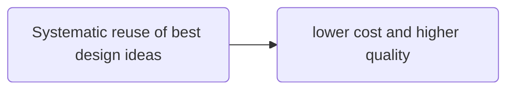
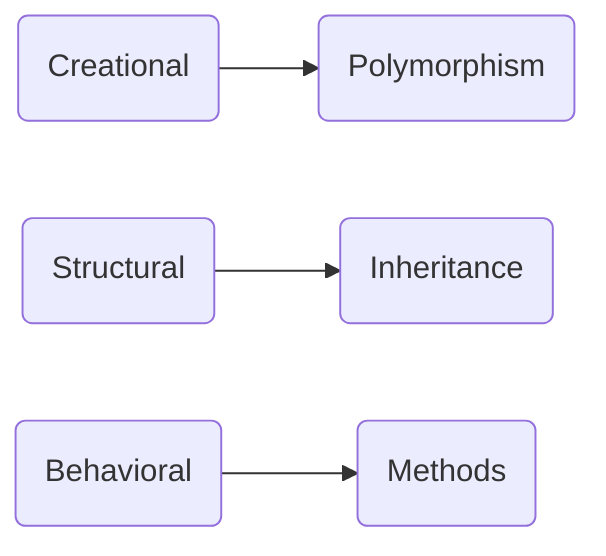
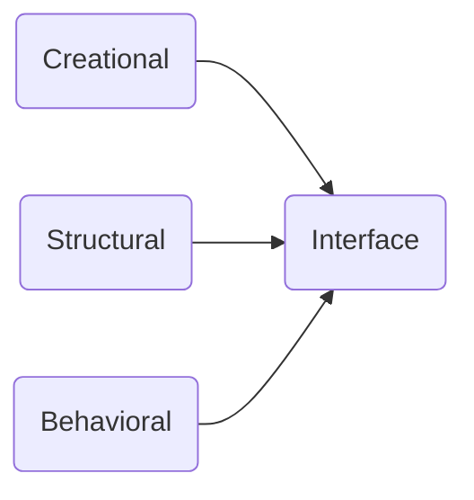
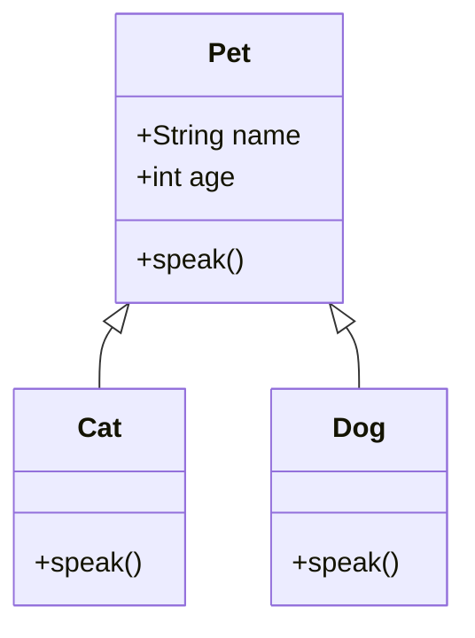
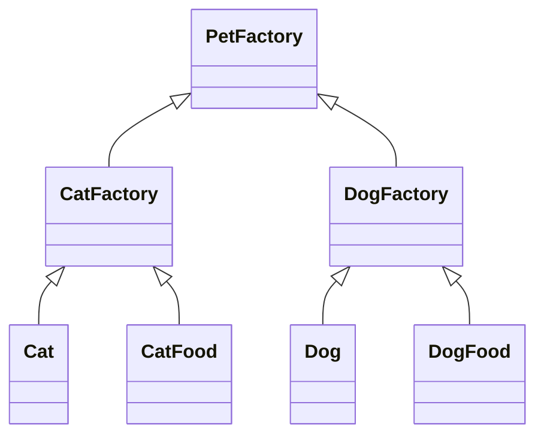

Design patterns are the well-known solutions to **recurring** problems.



### Characteristics

- Language neutral
- Dynamic
- Incomplete by design to promote customization.

### Design pattern types

- Creation
  - Use
    - Create objects systematically
  - Benefits
    - Flexibility
- Structural
  - Use
    - Establish relationship between software components
    - Accomplish both functional and non-functional goals
  - Benefits
    - Based on the goals structures can be defined
- Behavioral
  - Use
    - How well the objects can interact with each other
    - Accomplish both function and non-function goals
  - Benefits
    - Defining protocols while these objects interacting each other to achieve the common goal

### OOP use case for design patterns





### Inheritance

In object-oriented programming, inheritance is the mechanism of basing an object or class upon another object or class, retaining similar implementation. Also defined as deriving new classes from existing ones such as super class or base class and then forming them into a hierarchy of classes.



In the above **Cat** and **Dog** can inherit the attributes of **Pet**, but it will override the attribute _speak()_ based on their requirement.

### Polymorphism

- Relies on inheritance
- Allows child classes to be instantiated and treated as the same type as their parent
- Enables a parent class to be manifested any of its child classes.

### How to describe design pattern context

- Participants
  - Class involved to form a design pattern
  - Roles of these classes
- Quality attributes
  - Nonfunctional requirement's such as
    - usability
    - modifiability
    - reliability
    - performance
  - Effect on the entire software, such as
    - architectural solutions
- Forces
  - Various factors or trade-offs to consider
    - manifested in quality attributes
    - unintended consequences
- Consequences
  - worse performance
  - Decision makers should consider consequences.

### Pattern Language

- Name
  - capture the gist
  - vocabulary
  - Meaningful and memorable
- Context
  - Scenario
  - Insights on when and where
- Problem
  - Design challenges the pattern trying to address
- Solution
  - Specifies the pattern
  - Structure → relationships (between the elements)
  - Behavior → interactions (between the elements)
- Related patterns
  - Lists other patterns used to describe
  - Used together to solve a problem
  - Similar but different

## Factory

**Factory encapsulate object creation** that is factory is an object that is specialized in creating other object.

### Factory problem situation

- Uncertain in type of objects
- Decision to be made in runtime regarding what classes to use.

### Factory problem Scenario

A pet shop originally selling dogs only, now they want to sell cats too, and they want to describe their attributes too.

```python
class Dog:
  """A simple Dog class"""
  def __init__(self, name):
    slef._name = name

  def speak(self):
    return "Woof"

  def get_pet(pet="dog"):
    """Factory method"""
    pets = dict(dog=Dog("Hope"))
    return pets[pet]
```

```python
class Cat:
  """A simple Cat class"""
  def __init__(self, name):
    slef._name = name

  def speak(self):
    return "Meow"

# The below function not part of the Cat class
def get_pet(pet="dog"):
  """Factory method"""
  pets = dict(dog=Dog("Hope"), cat=Cat("Peace"))
  return pets[pet]
```

```python
# now will try initiate and test above classes
d = get_pet("dog")
print(d.speak())
# Output: Woof
c = get_pet("cat")
print(c.speak())
# Output: Meow
```

## Abstract Factory

Abstract factory builds on factory pattern and it' useful when we are expecting the family of related objects at a given time but doesn't have to know which family it is until runtime.

### Abstract Factory problem situation

- The user expectations yields

### Abstract Factory scenario

A pet factory whose concrete factories include dog factory and cat factory. Both dog and cat factories produce dogs and cats, as well as related products, such as dog food and cat food.



We implement our abstract factory without using inheritance because Python is a dynamically typed language, and therefore does not require abstract classes.

We implement our abstract factory without using inheritance because Python is a dynamically typed language, and therefore does not require abstract classes.
